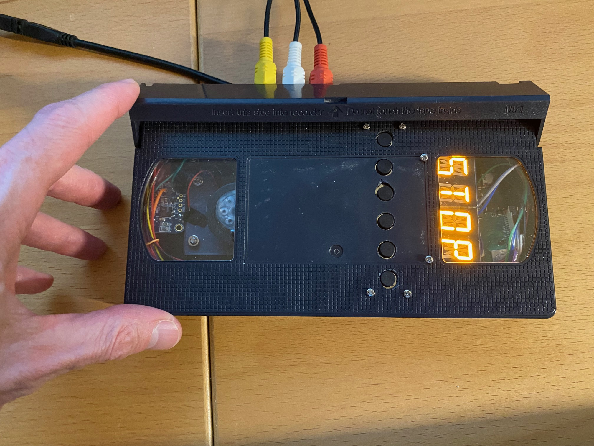

# Pi VCR
A video player/recorder designed to be housed inside a VHS cassette.

## Description

The device is based on a Raspberry Pi 3 and has pushbutton transport controls and a LED display reminicent of a 1980s VCR. It even has a rotating cassette reel!

## Hardware
 - [Raspberry Pi 3A+](https://www.raspberrypi.com/products/raspberry-pi-3-model-a-plus/) (although almost any Pi 3 or newer will work, only this one fits properly in the cassette shell with all the other parts)
 - USB composite video capture device like [this one](https://www.adafruit.com/product/4715?gad_source=1&gclid=Cj0KCQiAnfmsBhDfARIsAM7MKi1wdS5HnpMFaeHb39HGcsBSM0k1g0lLzFJhsMASe7mWKTzxYlqXkvwaAgzEEALw_wcB)
