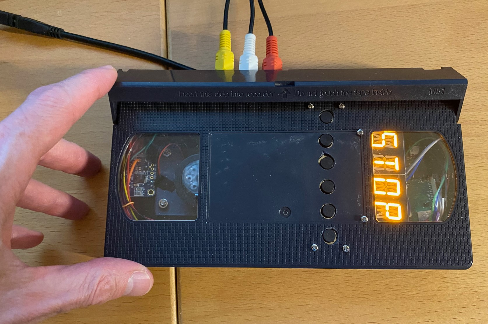

# Pi VCR
A video player/recorder designed to be housed inside a VHS cassette.

## Description

The device is based on a Raspberry Pi 3 and has pushbutton transport controls and a LED display reminicent of a 1980s VCR. It even has a rotating cassette reel!

## Hardware list
 - [Raspberry Pi 3A+](https://www.raspberrypi.com/products/raspberry-pi-3-model-a-plus/) (although almost any Pi 3 or newer will work, only this one fits properly in the cassette shell with all the other parts)
 - USB composite video capture device like [this one](https://www.adafruit.com/product/4715?gad_source=1&gclid=Cj0KCQiAnfmsBhDfARIsAM7MKi1wdS5HnpMFaeHb39HGcsBSM0k1g0lLzFJhsMASe7mWKTzxYlqXkvwaAgzEEALw_wcB)
- Some tactile buttons like [these](https://www.adafruit.com/product/1119)
- A [proto board](https://www.adafruit.com/product/4783) to mount the buttons
- This I2C [alphanumeric display](https://www.adafruit.com/product/2158)
- A [spindle motor](https://www.adafruit.com/product/3882) from a CD player
- A [motor driver board](https://www.adafruit.com/product/2448) like this Adafruit TB6612 1.2A DC/Stepper Motor Driver Breakout Board
- one 40 pin ribbon cable like [this one](https://www.amazon.com/Gowoops-Ribbon-Cable-40pin-Raspberry/dp/B01H53OK5U/)
- 2 three-position RCA Jacks like [this](https://www.amazon.com/gp/product/B09DC5WH9N/)
- A VHS cassette!

### Hardware setup

There are many options for assembling the hardware, but the images below show one way to make all of the parts fit together inside the VHS cassette. For more details see the Hackster article and the YouTube video. (both coming soon)

Some notes:
- The code lines [starting here](https://github.com/alanb128/pi-vcr/blob/main/vcr.py#L36) determine the GPIO pins to connect to the various pushbuttons, using a common ground. (pins are pulled high by default)
- The alphanumeric backpack is connected via I2C
- To fit the capture device in the case, remove its outer shell and disconnect the RCA cables from the pico blade connector. You can use combinations of connectors [such as these](https://www.adafruit.com/product/4722) to connect to the capture card's connectors to the RCA jacks.
- Use the vhs-rca-bracket.stl file in the repo to prnt brackets to hold the RCA jacks in place.
- Use the vhs-motor-bracket.stl file to print a bracket to hold the spindle motor in place.

## Software

The software runs on the [balena](www.balena.io) platform which makes running containers on the Pi very easy! Set up a free account and then simply click the button below to download an image which you can flash to a microSD card and boot the Pi from it.

If the hardware is assembled properly, the software should run and you'll see "VCR" on the display.

## Misc

### How it works

The media-player container runs a headless version of VLC (without a UI) and also uses the [python-vlc](https://pypi.org/project/python-vlc/) module to control VLC playback and recording. Adafruit libraries for the motor control hardware and alphanumeric display are also installed.

### To Do
The recording feature is still a bit dodgy. Since we want the device to record incoming audio/video and also display it, we're using the command on this line: https://github.com/alanb128/pi-vcr/blob/main/vcr.py#L62 However, it is difficult to stop the recording without restarting the whole Python script. If we could get the syntax to use that recording command with the Python API, it would work a lot better.

## References
I found some good examples of how to install, run, and control VLC in a container from this repo: https://github.com/ACMILabs/media-player

This link was also helpful: https://www.geeksforgeeks.org/vlc-module-in-python-an-introduction/

